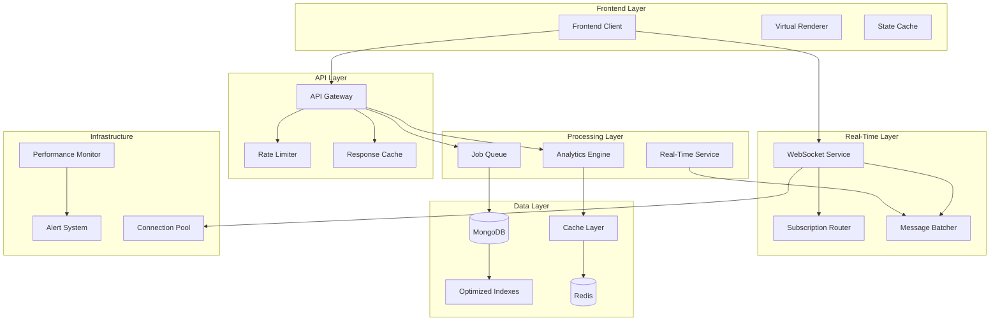

# Design Document: Trading Performance Optimization

## Overview

This design addresses critical performance bottlenecks in a multi-service trading application system. The system consists of a React frontend, Node.js API gateway, MongoDB database, Python market simulation service, Laravel verification service, and Redis messaging infrastructure.

The optimization strategy focuses on eight key areas: database performance, real-time data processing, API endpoint enhancement, frontend optimization, memory management, infrastructure caching, monitoring, and data consistency. The design implements targeted solutions that collectively aim to achieve 5-10x performance improvements while maintaining data integrity and system reliability.

Key performance targets:
- Database query response times under 100ms for 95% of requests
- WebSocket bandwidth reduction of 80% through selective broadcasting
- API response times under 200ms for 95% of requests
- Frontend CPU usage reduction of 50% during active trading
- Database load reduction of 60% through effective caching

## Architecture

The optimized architecture introduces several new components and patterns:



### Core Architectural Principles

1. **Selective Data Flow**: Replace broadcast patterns with targeted subscriptions
2. **Asynchronous Processing**: Move heavy operations to background jobs
3. **Multi-Layer Caching**: Implement caching at database, API, and frontend levels
4. **Resource Boundaries**: Enforce memory and connection limits throughout the system
5. **Performance Observability**: Comprehensive monitoring at every layer

## Components and Interfaces

### Database Layer Optimization

**Optimized Index Strategy**
```typescript
interface IndexConfiguration {
  collection: string;
  indexes: {
    fields: Record<string, 1 | -1>;
    options?: {
      background?: boolean;
      sparse?: boolean;
      unique?: boolean;
    };
  }[];
}

const stockPriceIndexes: IndexConfiguration = {
  collection: 'stockPriceHistory',
  indexes: [
    { fields: { symbol: 1, recorded_at: -1 } }, // Compound index for symbol + time queries
    { fields: { recorded_at: -1 } },            // Time-based queries
    { fields: { symbol: 1 } }                   // Symbol-only queries
  ]
};
```

**Query Optimization Interface**
```typescript
interface QueryOptimizer {
  batchUserPortfolios(userIds: string[]): Promise<UserPortfolio[]>;
  paginateStockHistory(symbol: string, page: number, limit: number): Promise<PaginatedResult<StockPrice>>;
  eliminateNPlusOne<T>(entities: T[], relationLoader: (ids: string[]) => Promise<any[]>): Promise<T[]>;
}
```

### Real-Time Data Processing

**Subscription Management**
```typescript
interface SubscriptionManager {
  subscribe(clientId: string, symbols: string[]): void;
  unsubscribe(clientId: string, symbols?: string[]): void;
  getSubscribers(symbol: string): string[];
  broadcastToSubscribers(symbol: string, data: StockUpdate): void;
}

interface MessageBatcher {
  addMessage(clientId: string, message: StockUpdate): void;
  flushBatch(clientId: string): StockUpdate[];
  configureBatchWindow(windowMs: number): void;
}
```

**Throttling and Backpressure**
```typescript
interface ThrottleController {
  shouldProcess(operation: string): boolean;
  recordOperation(operation: string): void;
  configureLimit(operation: string, maxPerSecond: number): void;
}

interface BackpressureManager {
  checkCapacity(queueName: string): boolean;
  applyBackpressure(queueName: string): void;
  releaseBackpressure(queueName: string): void;
}
```

### API Gateway Enhancement

**Asynchronous Job Processing**
```typescript
interface JobQueue {
  enqueue<T>(jobType: string, payload: T, options?: JobOptions): Promise<string>;
  process<T>(jobType: string, handler: (payload: T) => Promise<void>): void;
  retry(jobId: string, maxRetries: number): Promise<void>;
}

interface JobOptions {
  delay?: number;
  priority?: number;
  attempts?: number;
  backoff?: 'fixed' | 'exponential';
}
```

**Caching Strategy**
```typescript
interface CacheManager {
  get<T>(key: string): Promise<T | null>;
  set<T>(key: string, value: T, ttl?: number): Promise<void>;
  invalidate(pattern: string): Promise<void>;
  warmup(keys: string[]): Promise<void>;
}

interface CacheConfiguration {
  leaderboards: { ttl: 300 }; // 5 minutes
  userProfiles: { ttl: 1800 }; // 30 minutes
  stockPrices: { ttl: 60 };    // 1 minute
  analytics: { ttl: 900 };     // 15 minutes
}
```

### Frontend Optimization

**Selective Rendering System**
```typescript
interface SelectiveRenderer {
  updateStockRow(symbol: string, newPrice: StockPrice): void;
  batchUpdates(updates: StockUpdate[]): void;
  optimizeComponentTree(): void;
}

interface VirtualScrollManager {
  renderVisibleItems<T>(items: T[], containerHeight: number, itemHeight: number): T[];
  updateScrollPosition(scrollTop: number): void;
  getVisibleRange(): { start: number; end: number };
}
```

**State Management Optimization**
```typescript
interface OptimizedStateManager {
  debounceUpdates(updates: StateUpdate[], windowMs: number): StateUpdate[];
  memoizeSelectors<T>(selector: (state: any) => T): (state: any) => T;
  batchStateChanges(changes: StateChange[]): void;
}
```

### Memory and Resource Management

**Bounded Storage Implementation**
```typescript
interface BoundedStorage<T> {
  add(key: string, item: T): void;
  get(key: string): T | undefined;
  evict(key: string): void;
  size(): number;
  maxSize: number;
}

interface LRUCache<T> extends BoundedStorage<T> {
  touch(key: string): void;
  evictLeastRecent(): void;
}
```

**Resource Monitor**
```typescript
interface ResourceMonitor {
  trackMemoryUsage(): MemoryStats;
  trackConnectionCount(): ConnectionStats;
  alertOnThreshold(metric: string, threshold: number): void;
  generateReport(): ResourceReport;
}
```

## Data Models

### Optimized Stock Price Model
```typescript
interface StockPrice {
  _id: ObjectId;
  symbol: string;        // Indexed
  price: number;
  recorded_at: Date;     // Indexed
  volume?: number;
  change?: number;
  change_percent?: number;
}

interface PaginatedStockHistory {
  data: StockPrice[];
  pagination: {
    page: number;
    limit: number;
    total: number;
    hasNext: boolean;
    hasPrev: boolean;
  };
}
```

### WebSocket Message Models
```typescript
interface StockUpdate {
  symbol: string;
  price: number;
  timestamp: number;
  change?: number;
  volume?: number;
}

interface BatchedMessage {
  type: 'stock_updates';
  updates: StockUpdate[];
  timestamp: number;
  batchId: string;
}

interface SubscriptionMessage {
  type: 'subscribe' | 'unsubscribe';
  symbols: string[];
  clientId: string;
}
```

### Cache Data Models
```typescript
interface CacheEntry<T> {
  key: string;
  value: T;
  ttl: number;
  createdAt: number;
  accessCount: number;
}

interface LeaderboardCache {
  rankings: UserRanking[];
  lastUpdated: number;
  nextUpdate: number;
}

interface AnalyticsCache {
  totalTrades: number;
  totalVolume: number;
  activeUsers: number;
  topPerformers: UserSummary[];
  computedAt: number;
}
```

### Performance Metrics Models
```typescript
interface QueryMetrics {
  operation: string;
  duration: number;
  collection: string;
  indexUsed: boolean;
  documentsExamined: number;
  timestamp: number;
}

interface WebSocketMetrics {
  connectedClients: number;
  messagesPerSecond: number;
  subscriptionCount: number;
  bandwidthUsage: number;
  timestamp: number;
}

interface APIMetrics {
  endpoint: string;
  method: string;
  responseTime: number;
  statusCode: number;
  cacheHit: boolean;
  timestamp: number;
}
```

## Implementation Patterns

### Database Query Optimization Pattern
```typescript
class OptimizedQueryBuilder {
  // Eliminate N+1 queries through batch loading
  async loadUserPortfoliosWithPrices(userIds: string[]): Promise<UserPortfolio[]> {
    // Single query to get all portfolios
    const portfolios = await Portfolio.find({ userId: { $in: userIds } });
    
    // Extract unique symbols
    const symbols = [...new Set(portfolios.flatMap(p => p.holdings.map(h => h.symbol)))];
    
    // Single query to get all current prices
    const prices = await StockPrice.find({ 
      symbol: { $in: symbols },
      recorded_at: { $gte: new Date(Date.now() - 5 * 60 * 1000) } // Last 5 minutes
    }).sort({ recorded_at: -1 });
    
    // Build price lookup map
    const priceMap = new Map(prices.map(p => [p.symbol, p.price]));
    
    // Augment portfolios with prices
    return portfolios.map(portfolio => ({
      ...portfolio,
      holdings: portfolio.holdings.map(holding => ({
        ...holding,
        currentPrice: priceMap.get(holding.symbol) || holding.purchasePrice
      }))
    }));
  }
}
```

### WebSocket Subscription Pattern
```typescript
class SubscriptionRouter {
  private subscriptions = new Map<string, Set<string>>(); // clientId -> symbols
  private symbolSubscribers = new Map<string, Set<string>>(); // symbol -> clientIds
  
  subscribe(clientId: string, symbols: string[]): void {
    const clientSymbols = this.subscriptions.get(clientId) || new Set();
    
    symbols.forEach(symbol => {
      clientSymbols.add(symbol);
      
      const subscribers = this.symbolSubscribers.get(symbol) || new Set();
      subscribers.add(clientId);
      this.symbolSubscribers.set(symbol, subscribers);
    });
    
    this.subscriptions.set(clientId, clientSymbols);
  }
  
  broadcastToSubscribers(symbol: string, update: StockUpdate): void {
    const subscribers = this.symbolSubscribers.get(symbol);
    if (!subscribers) return;
    
    subscribers.forEach(clientId => {
      this.sendToClient(clientId, update);
    });
  }
}
```

### Message Batching Pattern
```typescript
class MessageBatcher {
  private batches = new Map<string, StockUpdate[]>();
  private batchTimers = new Map<string, NodeJS.Timeout>();
  private readonly BATCH_WINDOW = 100; // ms
  
  addMessage(clientId: string, update: StockUpdate): void {
    const batch = this.batches.get(clientId) || [];
    batch.push(update);
    this.batches.set(clientId, batch);
    
    // Set timer to flush batch if not already set
    if (!this.batchTimers.has(clientId)) {
      const timer = setTimeout(() => {
        this.flushBatch(clientId);
      }, this.BATCH_WINDOW);
      
      this.batchTimers.set(clientId, timer);
    }
  }
  
  private flushBatch(clientId: string): void {
    const batch = this.batches.get(clientId);
    if (!batch || batch.length === 0) return;
    
    // Send batched message
    const batchedMessage: BatchedMessage = {
      type: 'stock_updates',
      updates: batch,
      timestamp: Date.now(),
      batchId: `${clientId}-${Date.now()}`
    };
    
    this.sendToClient(clientId, batchedMessage);
    
    // Clear batch and timer
    this.batches.delete(clientId);
    const timer = this.batchTimers.get(clientId);
    if (timer) {
      clearTimeout(timer);
      this.batchTimers.delete(clientId);
    }
  }
}
```

### Frontend Virtual Scrolling Pattern
```typescript
class VirtualScrollManager<T> {
  private itemHeight: number;
  private containerHeight: number;
  private scrollTop: number = 0;
  
  constructor(itemHeight: number, containerHeight: number) {
    this.itemHeight = itemHeight;
    this.containerHeight = containerHeight;
  }
  
  getVisibleRange(totalItems: number): { start: number; end: number; offset: number } {
    const start = Math.floor(this.scrollTop / this.itemHeight);
    const visibleCount = Math.ceil(this.containerHeight / this.itemHeight);
    const end = Math.min(start + visibleCount + 1, totalItems); // +1 for buffer
    
    return {
      start: Math.max(0, start),
      end,
      offset: start * this.itemHeight
    };
  }
  
  renderVisibleItems(items: T[], renderItem: (item: T, index: number) => React.ReactElement): React.ReactElement[] {
    const { start, end } = this.getVisibleRange(items.length);
    const visibleItems: React.ReactElement[] = [];
    
    for (let i = start; i < end; i++) {
      if (items[i]) {
        visibleItems.push(renderItem(items[i], i));
      }
    }
    
    return visibleItems;
  }
}
```

### Caching Strategy Pattern
```typescript
class MultiLayerCache {
  private memoryCache = new Map<string, CacheEntry<any>>();
  private redisClient: Redis;
  
  async get<T>(key: string): Promise<T | null> {
    // L1: Memory cache
    const memoryEntry = this.memoryCache.get(key);
    if (memoryEntry && !this.isExpired(memoryEntry)) {
      return memoryEntry.value;
    }
    
    // L2: Redis cache
    const redisValue = await this.redisClient.get(key);
    if (redisValue) {
      const parsed = JSON.parse(redisValue);
      // Populate memory cache
      this.memoryCache.set(key, {
        key,
        value: parsed,
        ttl: 300, // 5 minutes in memory
        createdAt: Date.now(),
        accessCount: 1
      });
      return parsed;
    }
    
    return null;
  }
  
  async set<T>(key: string, value: T, ttl: number = 3600): Promise<void> {
    // Set in both layers
    this.memoryCache.set(key, {
      key,
      value,
      ttl: Math.min(ttl, 300), // Max 5 minutes in memory
      createdAt: Date.now(),
      accessCount: 0
    });
    
    await this.redisClient.setex(key, ttl, JSON.stringify(value));
  }
}
```

## Correctness Properties

*A property is a characteristic or behavior that should hold true across all valid executions of a system—essentially, a formal statement about what the system should do. Properties serve as the bridge between human-readable specifications and machine-verifiable correctness guarantees.*

### Database Performance Properties

**Property 1: Database query performance with indexes**
*For any* stock symbol or timestamp query, the database layer should complete the query within 50ms when proper indexes are used
**Validates: Requirements 1.1, 1.2**

**Property 2: Query batching eliminates N+1 patterns**
*For any* collection of user data requests, the database layer should execute a constant number of queries regardless of the collection size
**Validates: Requirements 1.3, 1.5**

**Property 3: Pagination bounds enforcement**
*For any* pagination request, the database layer should return at most 100 records per page
**Validates: Requirements 1.4**

**Property 4: Database response time consistency**
*For any* set of database queries, 95% should complete within 100ms
**Validates: Requirements 1.6**

### Real-Time Data Processing Properties

**Property 5: Selective WebSocket broadcasting**
*For any* stock price update and client subscription set, only clients subscribed to that specific symbol should receive the update
**Validates: Requirements 2.1**

**Property 6: Message batching within time windows**
*For any* sequence of rapid price updates within 100ms, the WebSocket service should batch them into a single message
**Validates: Requirements 2.2**

**Property 7: Database write throttling**
*For any* time period, the real-time service should not exceed 10 database write operations per second
**Validates: Requirements 2.3**

**Property 8: Connection pool boundaries**
*For any* Redis connection pool state, the number of connections should be between 5 and 20 inclusive
**Validates: Requirements 2.4**

**Property 9: Backpressure activation**
*For any* message queue that exceeds capacity thresholds, the system should apply backpressure to prevent overflow
**Validates: Requirements 2.5**

### API Performance Properties

**Property 10: Asynchronous processing non-blocking**
*For any* invoice generation request, trade operations should continue without blocking
**Validates: Requirements 3.1**

**Property 11: Leaderboard cache freshness**
*For any* leaderboard request, the response should be served from cache that is at most 5 minutes old
**Validates: Requirements 3.2**

**Property 12: API rate limiting enforcement**
*For any* user, the API gateway should reject requests that exceed 100 requests per minute
**Validates: Requirements 3.3**

**Property 13: Pre-computed analytics serving**
*For any* analytics request, the system should return pre-computed results rather than calculating in real-time
**Validates: Requirements 3.4**

**Property 14: Cached response performance**
*For any* frequently requested data, cached responses should be returned within 10ms
**Validates: Requirements 3.5**

**Property 15: API response time consistency**
*For any* set of API requests, 95% should complete within 200ms
**Validates: Requirements 3.6**

### Frontend Performance Properties

**Property 16: Selective component rendering**
*For any* stock price update, only the affected table rows should re-render, not the entire table
**Validates: Requirements 4.1**

**Property 17: Component memoization optimization**
*For any* dashboard state change, only components with modified data should re-render
**Validates: Requirements 4.2**

**Property 18: Virtual scrolling activation**
*For any* stock list exceeding 50 items, the frontend should implement virtual scrolling
**Validates: Requirements 4.3**

**Property 19: Dashboard API call optimization**
*For any* dashboard load, the frontend should make at most 3 initial API calls
**Validates: Requirements 4.4**

**Property 20: State update debouncing**
*For any* sequence of real-time updates, state changes should be debounced to at most 10 updates per second
**Validates: Requirements 4.5**

### Memory and Resource Management Properties

**Property 21: Bounded price history storage**
*For any* symbol, the price history store should maintain at most 1000 records in memory
**Validates: Requirements 5.1**

**Property 22: LRU cache eviction**
*For any* Redis cache state exceeding 80% memory usage, LRU eviction policies should be applied
**Validates: Requirements 5.2**

**Property 23: WebSocket message size limits**
*For any* WebSocket message, the size should not exceed 1KB
**Validates: Requirements 5.3**

**Property 24: Circular buffer implementation**
*For any* real-time price data processing, circular buffers should be used for history storage
**Validates: Requirements 5.4**

**Property 25: Memory usage alerting**
*For any* system state where memory usage exceeds 85%, alerts should be generated
**Validates: Requirements 5.5**

### Infrastructure and Caching Properties

**Property 26: TTL-based cache configuration**
*For any* data type, the cache layer should set appropriate TTL values based on data characteristics
**Validates: Requirements 6.1**

**Property 27: Asynchronous job processing**
*For any* background task, the job queue should process it without blocking other operations
**Validates: Requirements 6.2**

**Property 28: Cache-through behavior**
*For any* cache miss, the cache layer should automatically populate the entry with database data
**Validates: Requirements 6.3**

**Property 29: Scheduled data cleanup**
*For any* daily cleanup cycle, old price history records should be removed from storage
**Validates: Requirements 6.4**

**Property 30: Job retry with exponential backoff**
*For any* failed background job, the system should retry with exponentially increasing delays
**Validates: Requirements 6.5**

### Monitoring and Performance Metrics Properties

**Property 31: Comprehensive performance monitoring**
*For any* system operation, relevant performance metrics should be logged and tracked
**Validates: Requirements 7.1, 7.2, 7.3, 7.4**

**Property 32: Threshold-based alerting**
*For any* performance metric exceeding defined thresholds, alerts should be generated for administrators
**Validates: Requirements 7.5**

**Property 33: Performance dashboard completeness**
*For any* performance dashboard request, all key metrics and trends should be displayed
**Validates: Requirements 7.6**

### Data Consistency and Reliability Properties

**Property 34: Cache consistency maintenance**
*For any* cached data modification, cache invalidation should maintain consistency with the source data
**Validates: Requirements 8.1**

**Property 35: Exactly-once job processing**
*For any* critical background job, the system should ensure it is processed exactly once
**Validates: Requirements 8.2**

**Property 36: Throttling without data loss**
*For any* throttled database write operation, no price updates should be lost
**Validates: Requirements 8.3**

**Property 37: Pagination ordering consistency**
*For any* paginated query, the ordering should remain consistent across all page requests
**Validates: Requirements 8.4**

**Property 38: Data integrity preservation**
*For any* performance optimization implementation, data accuracy should be maintained
**Validates: Requirements 8.5**

### Performance Improvement Properties

**Property 39: Bandwidth usage reduction**
*For any* WebSocket communication pattern, selective broadcasting should reduce bandwidth usage by 80% compared to broadcast-all
**Validates: Requirements 2.6**

**Property 40: CPU usage optimization**
*For any* active trading period, frontend optimizations should reduce CPU usage by 50%
**Validates: Requirements 4.6**

**Property 41: Database load reduction**
*For any* system operation pattern, effective caching should reduce database load by 60%
**Validates: Requirements 6.6**

## Error Handling

### Database Error Handling
- **Connection Failures**: Implement connection retry with exponential backoff
- **Query Timeouts**: Set appropriate timeout values and fallback to cached data when possible
- **Index Missing**: Graceful degradation with performance warnings
- **Transaction Conflicts**: Retry logic for concurrent modification scenarios

### Real-Time Processing Error Handling
- **WebSocket Disconnections**: Automatic reconnection with subscription restoration
- **Message Queue Overflow**: Backpressure application and client notification
- **Redis Connection Loss**: Fallback to direct database queries with performance impact logging
- **Throttling Violations**: Queue overflow protection and rate limit notifications

### API Gateway Error Handling
- **Rate Limit Exceeded**: Return 429 status with retry-after headers
- **Cache Failures**: Fallback to database with performance impact logging
- **Job Queue Failures**: Retry with exponential backoff and dead letter queue
- **Timeout Scenarios**: Circuit breaker pattern for external service calls

### Frontend Error Handling
- **WebSocket Connection Loss**: Automatic reconnection with user notification
- **API Request Failures**: Retry logic with exponential backoff
- **Virtual Scrolling Errors**: Fallback to standard scrolling with performance warning
- **State Update Conflicts**: Conflict resolution with latest-wins strategy

### Memory and Resource Error Handling
- **Memory Limit Exceeded**: Aggressive cache eviction and garbage collection
- **Connection Pool Exhaustion**: Request queuing with timeout
- **Circular Buffer Overflow**: Oldest data eviction with logging
- **Resource Monitor Failures**: Fallback to basic system metrics

## Testing Strategy

### Dual Testing Approach

The testing strategy employs both unit testing and property-based testing as complementary approaches:

**Unit Tests**: Focus on specific examples, edge cases, and error conditions
- Database connection failures and recovery
- WebSocket disconnection scenarios  
- Cache eviction edge cases
- Rate limiting boundary conditions
- Memory threshold violations
- Specific performance regression scenarios

**Property Tests**: Verify universal properties across all inputs
- Database query performance across random symbols and timestamps
- WebSocket selective broadcasting with random subscription patterns
- Message batching behavior with varying update frequencies
- Cache consistency across random data modification patterns
- Resource boundary enforcement with random load patterns

### Property-Based Testing Configuration

**Testing Framework**: Use `fast-check` for JavaScript/TypeScript components and `Hypothesis` for Python components

**Test Configuration**:
- Minimum 100 iterations per property test
- Each property test references its design document property
- Tag format: **Feature: trading-performance-optimization, Property {number}: {property_text}**

**Example Property Test Structure**:
```typescript
// Feature: trading-performance-optimization, Property 1: Database query performance with indexes
test('database queries with indexes complete within 50ms', async () => {
  await fc.assert(fc.asyncProperty(
    fc.string({ minLength: 1, maxLength: 10 }), // Random symbol
    async (symbol) => {
      const startTime = Date.now();
      await queryStockBySymbol(symbol);
      const duration = Date.now() - startTime;
      expect(duration).toBeLessThan(50);
    }
  ), { numRuns: 100 });
});
```

### Integration Testing
- End-to-end performance testing with realistic load patterns
- Cross-service communication testing
- Cache invalidation and consistency testing
- Resource limit and recovery testing
- Monitoring and alerting system validation

### Performance Testing
- Load testing with gradual ramp-up to identify breaking points
- Stress testing to validate resource limits and error handling
- Endurance testing to identify memory leaks and resource degradation
- Baseline performance measurement before and after optimizations

### Monitoring Validation
- Verify all performance metrics are collected accurately
- Test alert generation at various threshold levels
- Validate dashboard data accuracy and completeness
- Ensure log aggregation and analysis capabilities